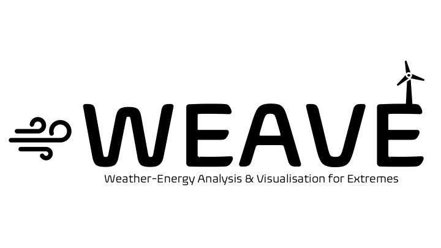

This is a Code for Earth Project developed by **Stella Bourdin & Clément Devenet**,
mentored by Edward Comyn-Platt, Laurent Dubus, Aron Zuicker, Laurens Stoop, Stefano Cordeddu & Alberto Troccoli.

In this project we will develop an interactive platform to visualise the impact of extreme weather events on the energy systems.
We will leverage the latest Pan-European Climate Database and Jupyter Notebooks to build our platform.
It will allow users to identify and analyse problematic events using historical data and future climate scenarios.

[Code for Earth page](https://codeforearth.ecmwf.int/project/weave-weather-energy-analysis-visualisation-for-extremes/)
